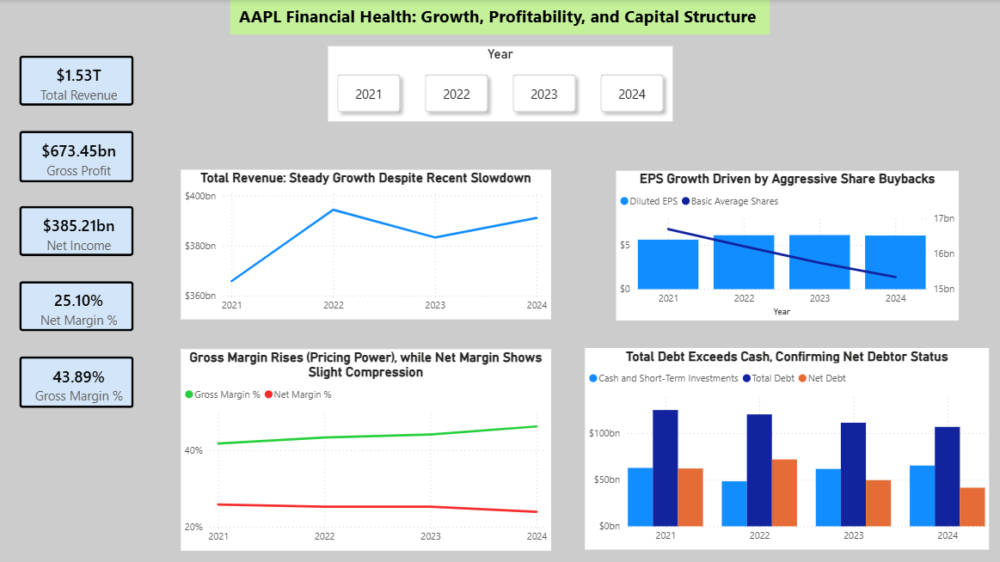
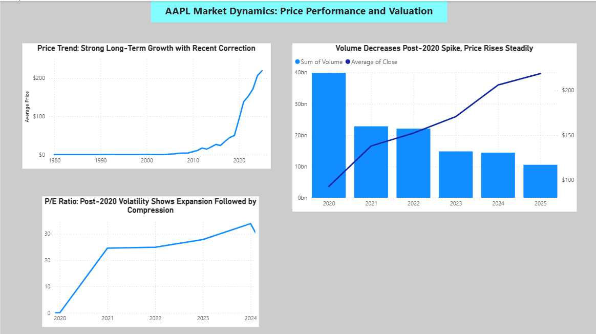

# 🍎 Apple (AAPL) Financial & Market Analysis (2020–2025)

## 🎯 Project Overview
This end-to-end Power BI project delivers a structured analysis of Apple Inc. (AAPL). The framework covers **Growth, Profitability, Financial Strength, and Valuation**, demonstrating the transformation of raw financial statements into actionable executive insights.

## 📊 Dashboard Preview

*Page 1: Financial Fundamentals & Profitability*

*Page 2: Market Behavior & Valuation Trends*

## 🛠️ Tech Stack & Skills
* **Power BI & Power Query:** Data modeling, star schema design, and ETL processes.
* **Advanced DAX:** Time intelligence (YoY growth), financial ratios, and market metrics.
* **Financial Analysis:** Balance sheet optimization, P/E volatility, and shareholder value (EPS) tracking.
* **Strategic Thinking:** Translation of data into management recommendations.

## ⚙️ Data Modeling & Architecture
1. **ETL (Power Query):** Merged Income Statements and Balance Sheets into a unified `Fact_Financials` table. Applied Unpivot and data typing to ensure consistency.
2. **Star Schema:** Established a dedicated `Dim_Date` table via DAX for precise time intelligence.
3. **Key Measures:** Developed complex DAX measures for Net Margin %, Debt-to-Equity, and Valuation multiples.

## 💡 Strategic Insights & Recommendations

| Insight | Recommendation | Strategic Rationale |
| :--- | :--- | :--- |
| **Gross Margin Expansion** | **Leverage Pricing Power** | Expanding margins confirm strong pricing power; focus on high-margin Services segment. |
| **EPS vs. Buybacks** | **Monitor Expense Efficiency** | EPS growth is heavily driven by share reduction. Focus on organic revenue to sustain long-term growth. |
| **Market Maturity** | **Institutional Focus** | Declining volume with rising price reflects a mature, institutionally-held stock. |
| **P/E Ratio Volatility** | **Tactical Entry Points** | Historical compression below 25x suggests potential entry points for long-term investors. |

## ✅ Key Takeaways
* Apple demonstrates resilient profitability despite Net Margin compression.
* Aggressive share buybacks remain a core driver of shareholder value.
* Market behavior reflects high institutional maturity, while valuation reveals expectation volatility.

---
**Data Source:** https://www.kaggle.com/datasets/jockeroika/apple-2025
